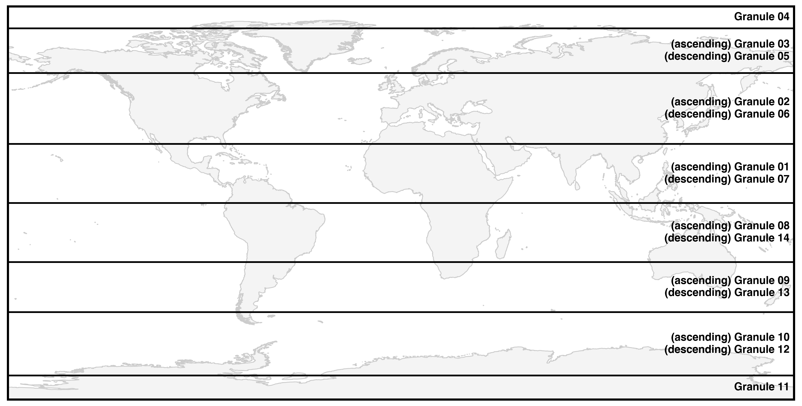
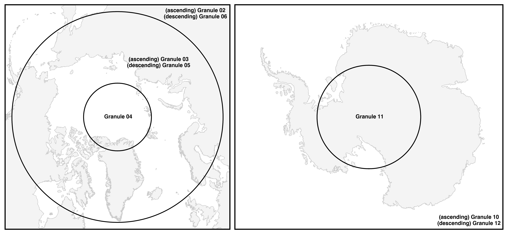

read-icesat-2
=============

Python tools to read elevation data from the NASA ICESat-2 mission  
https://icesat-2.gsfc.nasa.gov  
https://icesat-2-scf.gsfc.nasa.gov  
https://nsidc.org/data/icesat-2/  

### ICESat-2 Data Products

| Product | Name | Description |  
| ------- | ---- | ----------- |    
| **ATL00** | Telemetry Data | Raw ATLAS telemetry in packet format|   
| **ATL01** | Reformatted Telemetry | Parsed, partially reformatted into HDF5, generated daily, segmented into several minute granules|   
| **ATL02** | Science Unit Converted Telemetry | Photon time of flight, corrected for instrument effects. Includes all photons, pointing data, spacecraft position, housekeeping data, engineering data, and raw atmospheric profiles, segmented into several minute granules.|   
| **ATL03** | Global Geolocated Photon Data | Precise latitude, longitude and elevation for every received photon, arranged by beam in the along-track direction. Photons classified by signal vs. background, as well as by surface type (land ice, sea ice, land, ocean), including all geophysical corrections. Segmented into several minute granules.|   
| **ATL04** | Uncalibrated Backscatter Profiles | Along-track atmospheric backscatter data, 25 times per second. Includes calibration coefficients for polar regions. Segmented into several minute granules.|   
| **ATL06** | Land Ice Elevation | Surface height for each beam with along- and across-track slopes calculated for each beam pair. Posted at 40m along-track; segmented into several minute granules.|   
| **ATL07** | Arctic/Antarctic Sea Ice Elevation | Height of sea ice and open water leads at varying length scale based on returned photon rate for each beam presented along-track|   
| **ATL08** | Land Water Vegetation Elevation | Height of ground including canopy surface posted at variable length scales relative to signal level, for each beam presented along-track. Where data permits include canopy height, canopy cover percentage, surface slope and roughness, and apparent reflectance.|   
| **ATL09** | Calibrated Backscatter and Cloud Characteristics  | Along-track cloud and other significant atmosphere layer heights, blowing snow, integrated backscatter, and optical depth.|   
| **ATL10** | Arctic/Antarctic Sea Ice Freeboard | Estimate of sea ice freeboard over specific spatial scales using all available sea surface height measurements. Contains statistics of sea surface and sea ice heights.|   
| **ATL11** | Antarctica / Greenland Ice Sheet H(t) Series | Time series of height at points on the ice sheet, calculated based on repeat tracks and/or cross-overs.|   
| **ATL12** | Ocean Elevation | Surface height at specific length scale.|   
| **ATL13** | Inland Water Height | Along-track inland and near shore water surface height distribution within water mask.|   
| **ATL14** | Antarctica / Greenland Ice Sheet H(t) Gridded | Height maps of each ice sheet for each year based on all available elevation data.|   
| **ATL15** | Antarctica / Greenland Ice Sheet dh/dt Gridded | Height change maps for each ice sheet, for each mission year, and for the whole mission.|   
| **ATL16** | ATLAS Atmosphere Weekly | Polar cloud fraction, blowing snow frequency, ground detection frequency.|   
| **ATL17** | ATLAS Atmosphere Monthly | Polar cloud fraction, blowing snow frequency, ground detection frequency.|   
| **ATL18** | Land/Canopy Gridded | Gridded ground surface height, canopy height, and canopy cover estimates.|   
| **ATL19** | Mean Sea Surface (MSS) | Gridded ocean height product.|     
| **ATL20** | Arctic / Antarctic Gridded Sea Ice Freeboard | Gridded sea ice freeboard.|     
| **ATL21** | Arctic/Antarctic Gridded Sea Surface Height w/in Sea Ice | Gridded monthly sea surface height inside the sea ice cover.|     

### ICESat-2 Granules
Each orbit of ICESat-2 data is broken up into 14 granules.  The granule boundaries limit the size of each ATL03 file and simplify the formation of higher level data products.  
  
  

### nsidc\_icesat2\_sync.py

-   Syncs all available ICESat-2 data for a specified data product, release, granule and track.  
-   The first time we run the script, it will copy the necessary dataset in the selected local directory.  
-   If we already have all the data, and we run the script again: only files added or modified on the remote server will downloaded.  

```bash
python nsidc_icesat2_sync.py --user=<username> --directory=<outgoing> \
	--release=001 --granule=10,11,12 --mode=0o775 ATL06
```
`-U X`, `--user=X`: username for NASA Earthdata Login  
`-D X`, `--directory`: local working directory for receiving data  
`--release=X`: ICESat-2 data release to sync  
`--version=X`: ICESat-2 data version to sync  
`--track=X`: ICESat-2 reference ground tracks to sync  
`--granule=X`: ICESat-2 granule regions to sync  
`--auxiliary`: Sync ICESat-2 auxiliary files for each HDF5 file  
`-M X`, `--mode=X`: Local permissions mode of the directories and files synced  
`--log`: output log of files downloaded  
`--list`: print files to be transferred, but do not execute transfer  
`-C`, `--clobber`: Overwrite existing data in transfer  

Also look into using the NSIDC subsetting API  
https://github.com/tsutterley/nsidc-subsetter  

### copy\_scf\_ICESat2\_files.py
Copies ICESat-2 HDF5 files from the SCF server  
```bash
python copy_scf_ICESat2_files.py --scf_host=<host> --scf_user=<username> \
	--product=ATL06 --release=001 --granule=10,11,12 --cycle=1,2 \
	--scf_outgoing=<path_to_outgoing> --verbose --mode=0o775
```
`-h`, `--help`: list the command line options  
`--scf_host=X`: hostname of the SCF server  
`--scf_user=X`: SCF server username  
`-D X`, `--directory=X`: local working directory for receiving data  
`--product=X`: ICESat-2 data product to copy  
`--release=X`: ICESat-2 data release to copy  
`--version=X`: ICESat-2 data version to copy  
`--granule=X`: ICESat-2 granule regions to copy  
`--cycle=X`: ICESat-2 cycle to copy  
`--track=X`: ICESat-2 tracks to copy  
`--scf_incoming=X`: directory on the SCF where the rscf sends PANS  
`--scf_outgoing=X`: directory on the SCF where the data resides  
`-C`, `--clobber`: overwrite existing data in transfer  
`-V`, `--verbose`: output information about each synced file  
`-M X`, `--mode=X`: permission mode of directories and files synced  
`-L`, `--list`: only list files to be transferred  


### read\_ICESat2\_ATL03.py
Read ICESat-2 ATL03 and ATL09 data files  
- ATL03 datasets: Global Geolocated Photons  
- ATL09 datasets: Atmospheric Characteristics

### read\_ICESat2\_ATL06.py
Read ICESat-2 ATL06 data files  
- ATL06 datasets: Land Ice Elevation   

### read\_ICESat2\_ATL07.py
Read ICESat-2 ATL07 data files  
- ATL07 datasets: Sea Ice Height   

#### Dependencies
 - [numpy: Scientific Computing Tools For Python](http://www.numpy.org)  
 - [scipy: Scientific Tools for Python](http://www.scipy.org)  
 - [h5py: Python interface for Hierarchal Data Format 5 (HDF5)](http://h5py.org)  
 - [lxml: processing XML and HTML in Python](https://pypi.python.org/pypi/lxml)  
 - [paramiko: Native Python SSHv2 protocol library](http://www.paramiko.org/)  
 - [scp: scp module for paramiko](https://github.com/jbardin/scp.py)  
 - [future: Compatibility layer between Python 2 and Python 3](http://python-future.org/)  

#### Download
The program homepage is:   
https://github.com/tsutterley/read-icesat-2   
A zip archive of the latest version is available directly at:    
https://github.com/tsutterley/read-icesat-2/archive/master.zip  

#### Disclaimer  
This program is not sponsored or maintained by the Universities Space Research Association (USRA) or NASA.  It is provided here for your convenience but _with no guarantees whatsoever_.  
